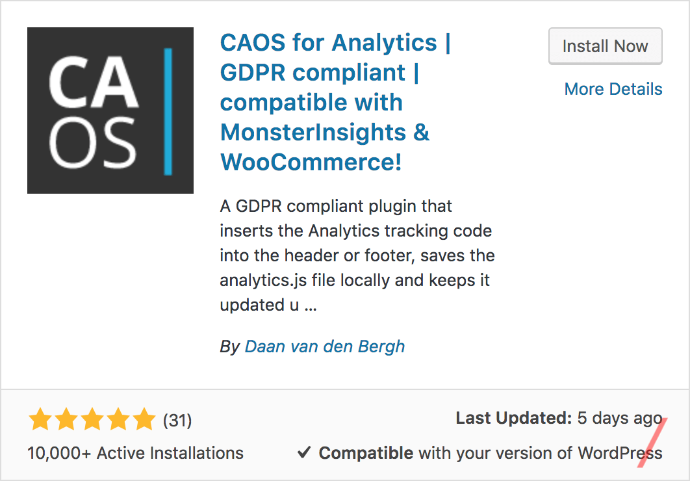
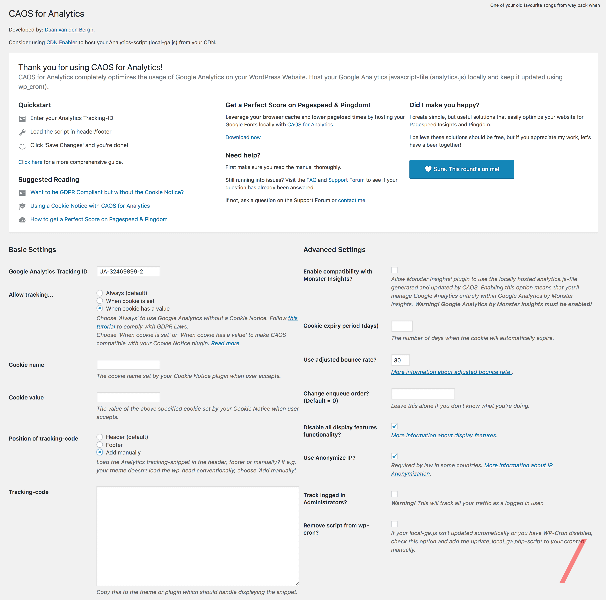

When you start paying attention to the [speed of your WordPress site][1], one of the most important things to look after is all the external requests that your site makes to all kinds of services.

A popular external request that many sites make is to Google Analytics.

And when you [test your site in GTmetrix][2] or Pingdom, you will notice the following message:

> Leverage browser caching for the following cacheable resources: https://www.google-analytics.com/analytics.js

In this tutorial, I will tell you how to host Google Analytics locally in WordPress to Leverage Browser Caching in order to increase the speed and the score of your site in GTmetrix.

## How To Host Google Analytics Locally In WordPress

The solution is very simple and it comes in the form of a plugin.

This plugin is called [CAOS for Analytics][3] and it's developed by [Daan van den Bergh][4].

Daan wrote a 5 pages article back in 2016 titled [How To Get A 100/100 Score On Pingdom & Google Pagespeed Insights][5]. The premise of this article is obvious from its title.

The reason I mentioned it is to give you an idea about Daan. He's a developer who won't settle for less than 100 point score in Pingdom & Google Pagespeed Insights 👍

So, when Daan made a plugin that allows you to host Google Analytics locally in WordPress and it helps you with the Leverage Browser Caching notice, then you should absolutely try it because this guy knows what he's doing.

Let's take a look at it, shall we!

### Step 1

Go to Plugins > Add New

### Step 2

Search for [CAOS for Analytics][3]. Install & Activate it.

### Step 3

On the left sidebar, under settings, click on **Optimize Analytics** and you will see all these options that might look intimidating at first, but it's not.

Let's take a look at each one of them:

There are 2 types of settings, Basic Settings & Advanced Settings

### Basic Settings

Under basic settings you have the option to add your Google Analytics Code, choose when you want to allow tracking, configure the plugin to be completely GDPR Compliant [with][9] or [without][10] a cookie notice.

And last, in this section, you can pick where you want the tracking code to be placed, whether it's in the header, footer or if you want to insert it manually.

### Advanced Settings

The first option in this section of the plugin is to Enable compatibility with [Monster Insights][11]. What this option allows you to do is if you have Monster Insights installed and configured, just enable this option and Monster Insights will start using the local analytics.js file that CAOS has created.

Enabling this option will disable all other options in CAOS since Monster Insights is your main Google Analytics plugin and CAOS will just serve as the plugin that creates the local analytics.js file.

Other options available here are set the number of days until cookies expire, [adjusted bounce rate][12], Change enqueue order, Disable all [display features functionality][13], [Anonymize IP][14], Track logged in Administrators and last Remove script from wp-cron.

## Conclusion

I love this plugin, it's the easiest way to host Google Analytics locally in WordPress and I recommend it to everyone who's looking to Leverage browser caching and improve their GTmetrix score.

I myself use it with Monster Insights because, in the latter, I use the Events Tracking feature that allow me to track clicks on outbound and affiliate links.

[1]: https://www.news47ell.com/reviews/lightning-base-review-managed-wordpress-hosting/
[2]: https://www.news47ell.com/reviews/litespeed-cache-review-best-wordpress-caching-plugin/
[3]: https://wordpress.org/plugins/host-analyticsjs-local/
[4]: https://dev.daanvandenbergh.com/about/
[5]: https://dev.daanvandenbergh.com/how-to/pagespeed-pingdom-w3tc-autoptimize/
[9]: https://dev.daanvandenbergh.com/wordpress/analytics-gdpr-caos/
[10]: https://dev.daanvandenbergh.com/wordpress/analytics-gdpr-anonymize-ip-cookie-notice/
[11]: https://wordpress.org/plugins/google-analytics-for-wordpress/
[12]: https://moz.com/blog/adjusted-bounce-rate
[13]: https://developers.google.com/analytics/devguides/collection/analyticsjs/display-features
[14]: https://support.google.com/analytics/answer/2763052?hl=en
